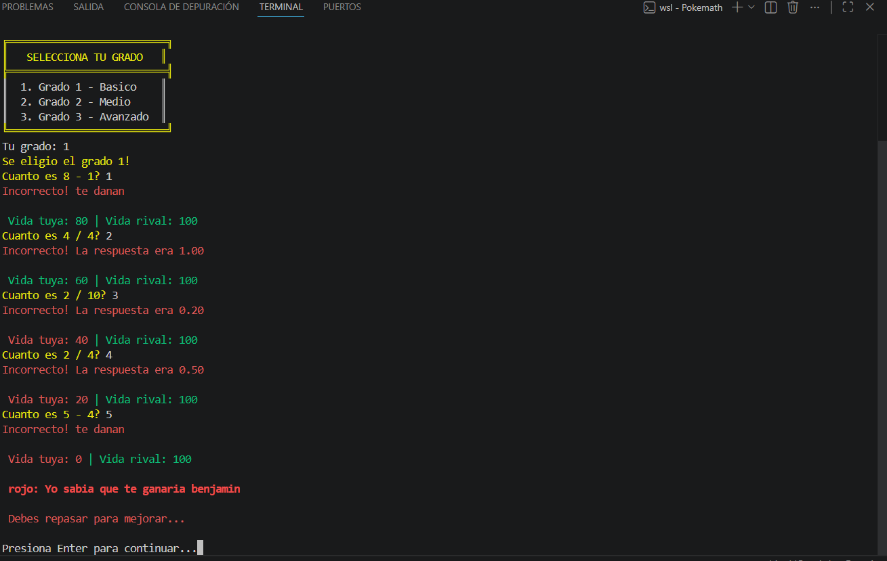
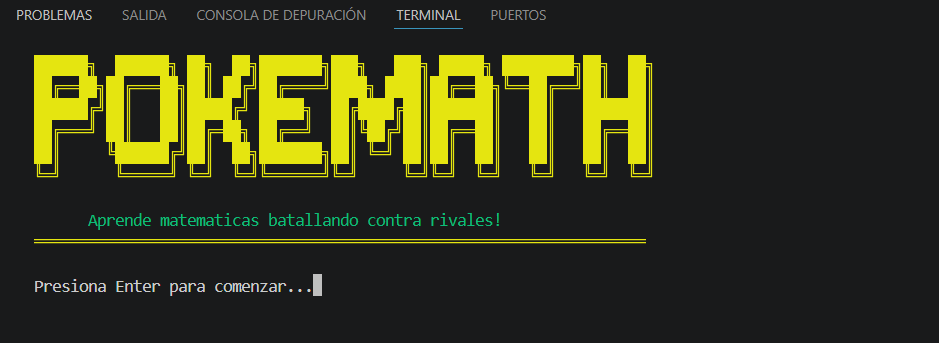
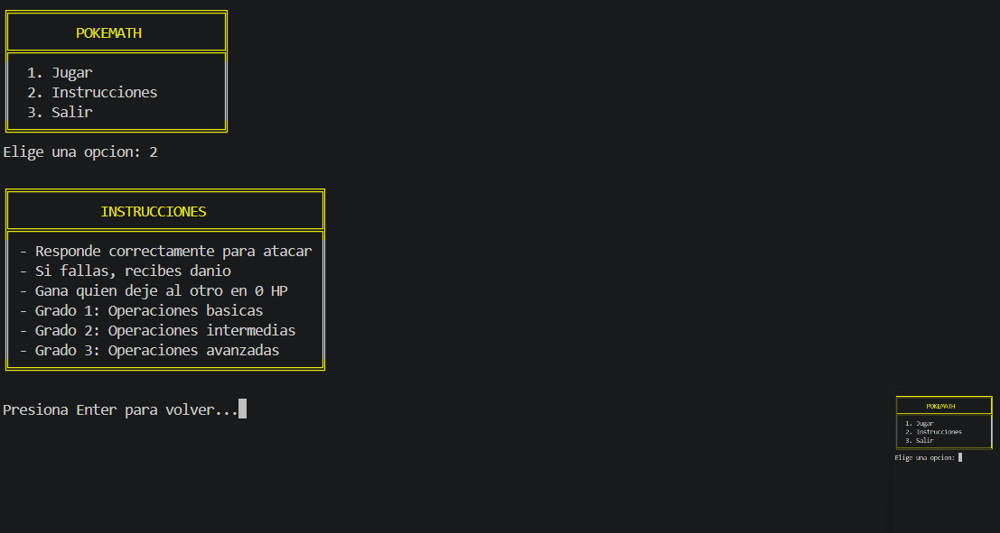
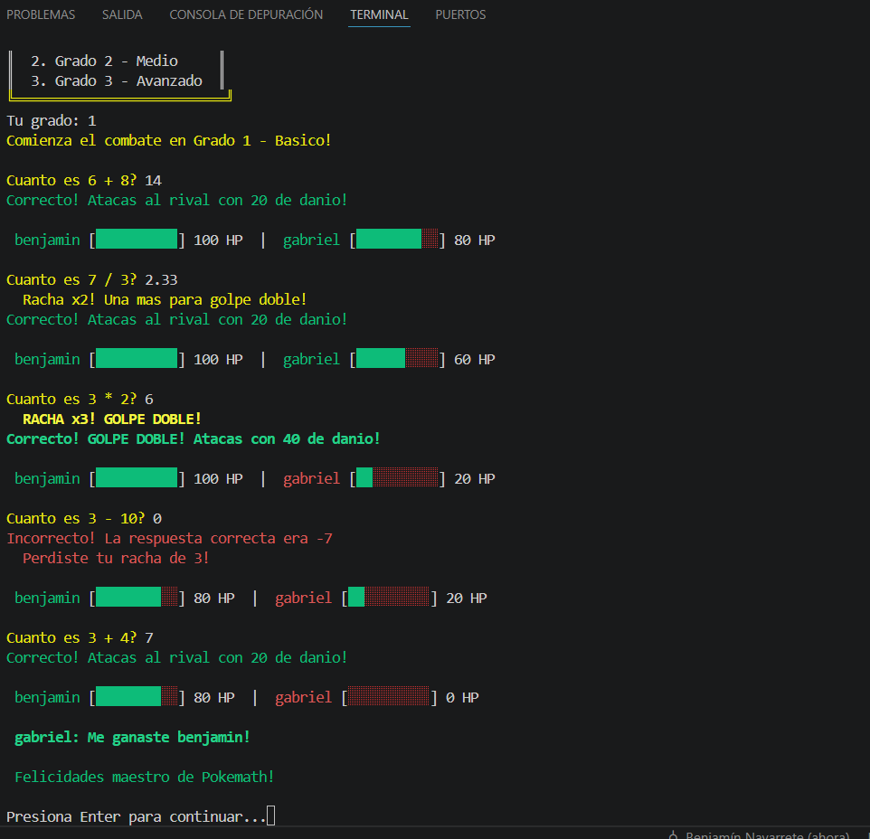
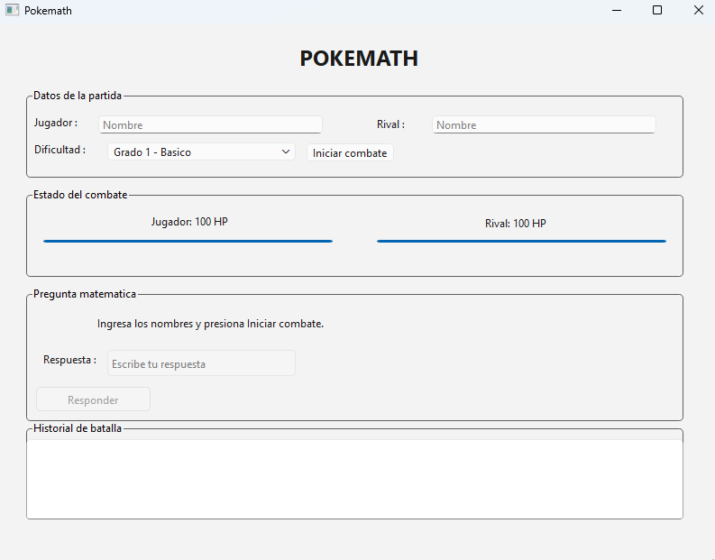

## Pokemath
## DESCRIPCIÓN DEL PROYECTO:

Pokemath es una aplicación educativa que busca abordar la baja motivación de los jóvenes hacia el aprendizaje de las matemáticas. A través de la gamificación inspirada en la temática de Pokémon, el proyecto propone una forma interactiva y entretenida de practicar ejercicios matemáticos.

El juego se basa en un sistema de batallas donde los usuarios deben resolver ejercicios matemáticos para atacar a su oponente, combinando aprendizaje con dinámicas propias de los videojuegos.

## OBJETIVOS GENERALES:

Fomentar el interés de los jóvenes por las matemáticas mediante una herramienta educativa interactiva que permita mejorar sus habilidades de forma entretenida.

## OBJETIVOS ESPECÍFICOS:

Diseñar un juego tipo RPG basado en la temática de Pokémon, donde las batallas se desarrollen mediante ejercicios matemáticos.

Desarrollar ejercicios matemáticos adaptados al nivel del usuario y mejorar la interfaz del juego para facilitar la interacción y comprensión.

Incentivar la participación de los usuarios mediante un sistema de recompensas, progreso y desafíos.

## FUNCIONALIDAD DEL SISTEMA:

El usuario ingresa su nombre y selecciona un nivel de dificultad.
Luego,entrara al mundo donde se enfrenta a rivales en batallas donde el deberá resolver ejercicios matemáticos.

Si responde correctamente → ataca al rival
Si responde incorrectamente → recibe daño

El combate continúa hasta que la vida de uno de los jugadores llegue a cero.

## NIVELES DE DIFICULTAD:

Grado 1: Operaciones básicas.
Grado 2: Operaciones intermedias.
Grado 3: Operaciones más complejas. (en desarrollo)

## ESTADO DEL PROYECTO:

Actualmente, el proyecto se encuentra en desarrollo utilizando el lenguaje C.
Se ha implementado un sistema funcional de combate con ejercicios matemáticos nivel(grado1) y generación aleatoria de preguntas.

## TECNOLOGIA USADA:

Lenguaje de programación: C
Librerías estándar:
stdio.h
stdlib.h
time.h

## INSTALACION Y COMPILACION:

Compilación:

gcc main.c funciones.c -o pokemath

Ejecución:

./pokemath

## EVIDENCIA DE AVANCE HITO 1:

## ESTRUCTURA DEL JUEGO:

main.c → Control principal del programa
funciones.c → Lógica del juego y ejercicios
funciones.h → Declaración de funciones

## ROLES:

Gabriel Norambuena: programador principal

Encargado de desarrollar la lógica central del juego, incluyendo el sistema de combate y la implementación de los ejercicios matemáticos.

Benjamin Vasquez: Diseño de ejercicios y dificultad

Encargado de crear y estructurar los ejercicios matemáticos, asegurando que se adapten a los distintos niveles de dificultad del juego.

Benjamin Navarrete: Organizacion y planificacion de proyecto

Responsable de coordinar el trabajo del equipo, definir objetivos, gestionar tiempos y asegurar el cumplimiento de los hitos del proyecto

Benjamin Ezquivel:Documentación y presentación

Responsable de la elaboración del README, informes y material de presentación, además de apoyar en la comunicación del proyecto.

## IMPACTO ESPERADO:

Se espera que Pokemath contribuya a mejorar la percepción de las matemáticas en los jóvenes, transformando el aprendizaje en una experiencia más dinámica, interactiva y motivadora.

## MEJORAS PARA EL HITO 2

Implementación completa del grado 3
Mayor variedad de ejercicios matemáticos
Sistema de puntuación y progreso
Interfaz gráfica
Incorporación de más elementos inspirados en Pokémon

## CAMBIOS ANTES DE TRANSFORMARLO EN C++
se le agrego un grado 3 que no estaba implementada een el hito 1.
se le implemento colores ascii para tener una mejora visual en el juego:

## MIGRACION DE C A C++

-El Hito 1 fue desarrollado en C con tres archivos (main.c, funciones.c, funciones.h). Para el Hito 2 migramos completamente a C++ con diseño orientado a objetos.

Esta migración fue realizada con apoyo de Claude (IA). Partimos del código funcional del Hito 1 y usamos la herramienta para ayudarnos a restructurarlo en clases, ya que el equipo estaba en proceso de aprender POO en C++.

Las principales dificultades fueron entender cuándo usar herencia versus composición, y trabajar con `std::unique_ptr`, que no existe en C.

## CAMBIOS RESPECTO AL HITO 1
 Se completó el Grado 3 que estaba pendiente.
 Se agregaron colores ANSI para mejorar la experiencia visual.
 Se separó la lógica en clases con responsabilidades claras.
 El menú, la selección de grado y las instrucciones pasaron a la clase menu.

 ## CLASES PRINCIPALES Y RELACIONES
 Pregunta
->PreguntaSuma, PreguntaResta, PreguntaMultiplicacion, PreguntaDivision
->PreguntaAreaTriangulo, PreguntaPorcentaje, PreguntaEcuacionLineal, PreguntaDivisionDecimal
->PreguntaCuadratica, PreguntaPotencia, PreguntaSistemaEcuaciones, PreguntaRaizCuadrada, PreguntaLogaritmo
Grado
-> Grado1 → genera preguntas de Grado 1
-> Grado2 → genera preguntas de Grado 2
-> Grado3 → genera preguntas de Grado 3
Jugador→ nombre, vida, victorias
Combate→ orquesta el loop de combate usando Jugador y Grado
Menu→ pantalla de bienvenida, menú principal, selección de grado

## ESTRUCTURA DEL PROYECTO
src/
->main.cpp
-> Menu.h / Menu.cpp
-> Combate.h / Combate.cpp
-> Jugador.h / Jugador.cpp
-> Grado.h / Grado.cpp
-> Grado1.h / Grado1.cpp
-> Grado2.h / Grado2.cpp
-> Grado3.h / Grado3.cpp
-> Pregunta.h / preguntas.cpp
-> PreguntasGrado1.h / preguntagrado1.cpp
-> PreguntasGrado2.h / preguntagrado2.cpp
-> PreguntasGrado3.h / preguntagrado3.cpp
-> Colores.h

## COMPILACION
g++ -std=c++14 -o pokemath main.cpp Menu.cpp Combate.cpp Jugador.cpp Grado.cpp Grado1.cpp Grado2.cpp Grado3.cpp preguntas.cpp preguntagrado1.cpp preguntagrado2.cpp preguntagrado3.cpp

## EJECUCION
./pokemath

## EVIDENCIA DEL HITO 2 

## Pantalla de inicio

## Instrucciones

## Ejemplo de batalla

## PROXIMOS PASOS DEL HITO 3
Sistema de puntuación persistente entre partidas
Mayor variedad de preguntas por grado
 Posible incorporación de elementos adicionales inspirados en Pokémon (ataques especiales, tipos, etc.)

# HITO 3: IMPLEMENTACIÓN DE INTERFAZ GRÁFICA EN QT

Para el Hito 3 se implementó una interfaz gráfica básica para Pokemath utilizando Qt Creator, Qt Designer y Qt Widgets.

La interfaz fue creada usando principalmente widgets arrastrables desde Qt Designer. De esta forma se organizó visualmente la ventana antes de conectarla con el código en C++.

## OBJETIVO DEL HITO 3:

El objetivo de este hito fue transformar la interacción del juego que funcionaba por consola en una interfaz gráfica más clara, visual y fácil de utilizar.

Con esta nueva versión, el usuario puede jugar Pokemath sin tener que responder preguntas directamente desde la terminal.

## WIDGETS UTILIZADOS:

QLabel

QLineEdit

QComboBox

QPushButton

QProgressBar

QTextEdit

QGroupBox

QVBoxLayout

QHBoxLayout

## Evidencia de avances en hito 3

